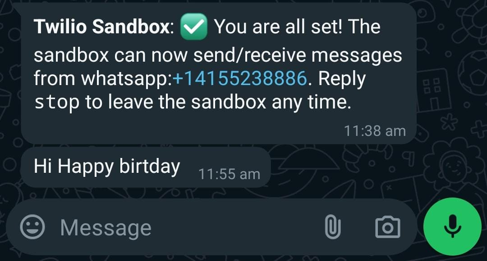
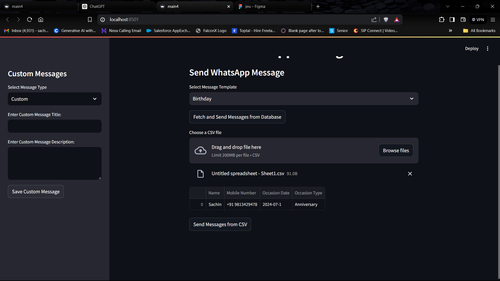
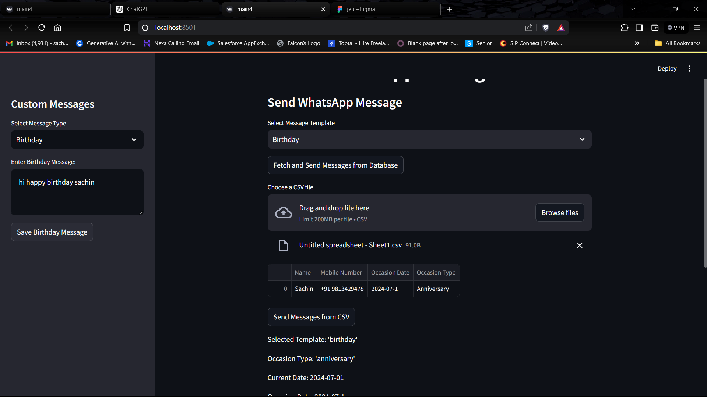

# WhatsFun: The Occasion Message Blaster

---

## Overview

Welcome to **WhatsFun: The Occasion Message Blaster**! This project automates the process of sending personalized WhatsApp messages using Twilio and MongoDB. Users can create, save, and send messages for various occasions like birthdays and anniversaries. The project is built using Streamlit for the frontend and supports custom message templates.

---

## Features

- **User-Friendly Interface**: Easily manage and send messages through a streamlined dashboard.
- **Custom Messages**: Create and save custom message templates for any occasion.
- **Automated Sending**: Automatically send messages based on occasion types and dates.
- **CSV Upload**: Upload CSV files with contact details and occasion information.
- **Database Integration**: Fetch and send messages from MongoDB.
- **Debugging Information**: Detailed debug output for tracking issues.

---

## Usage

1. **Environment Setup**:
   - Install required packages:
     ```bash
     pip install streamlit twilio pymongo pandas python-dotenv
     ```

2. **Environment Variables**:
   - Create a `.env` file in the project root directory with the following content:
     ```
     TWILIO_ACCOUNT_SID=your_account_sid
     TWILIO_AUTH_TOKEN=your_auth_token
     MONGO_URI=your_mongodb_uri
     ```

3. **Running the Application**:
   - Start the Streamlit application:
     ```bash
     streamlit run main.py
     ```

4. **Using the Dashboard**:
   - Navigate to the dashboard in your web browser.
   - Select or create a message template.
   - Upload a CSV file with the required contact and occasion details.
   - Click "Send Messages from CSV" to send messages.

---

## Example

Here are some screenshots of the application in action:

- **Twilio Sandbox Setup**:
  

- **Custom Message Creation**:
  

- **Dashboard**:
  

---

## Contact

For any questions or support, please contact:
- **Email**: [sachinparmar98134@gmail.com](mailto:sachinparmar98134@gmail.com)

---

## Future Enhancements

- **Scheduled Messages**: Implement functionality to schedule messages for future dates.
- **Notification System**: Add notifications for successful and failed message deliveries.
- **Enhanced Templates**: Support for more dynamic and complex message templates.

---

## Contribution

Contributions are welcome! Please fork this repository and submit pull requests for any features or bug fixes.


---

With **WhatsFun**, make sure your friends and family always receive their special messages on time, and have fun doing it!
